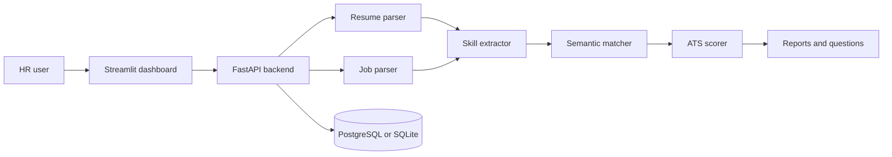

# HireSense AI

Intelligent resume screening and candidate ranking platform built from the project guide. HR teams can upload resumes, paste a job description, extract candidate details, identify skills, calculate match scores, explain gaps, rank applicants, generate interview questions, and view recruiter-ready summaries.

## Features

- Resume parsing for PDF, DOCX, TXT, and text-like files.
- Resume text cleaning and lightweight profile extraction.
- Skill extraction from a structured skill dictionary.
- Job description parsing for skills, education, and experience.
- Semantic matching with optional SentenceTransformers and a TF-IDF fallback.
- Weighted ATS scoring: skills, experience, education, projects, formatting, and certifications.
- Candidate ranking, skill gap analysis, explainability, interview questions, and recruiter reports.
- FastAPI backend and Streamlit dashboard frontend.
- SQLAlchemy database models ready for PostgreSQL.
- Tests, Docker, and deployment-friendly configuration.

## Architecture



## Project Structure

```text
HireSense-AI/
  app/
    api/          FastAPI routes
    database/     SQLAlchemy setup
    ml/           Skill dictionary
    models/       Pydantic schemas and database models
    prompts/      LLM/report prompts
    services/     Parsing, extraction, matching, scoring, reports
    utils/        File helpers
  frontend/       Streamlit app
  tests/          Unit and API tests
  datasets/       Sample inputs
  notebooks/      Experiment notebooks
  screenshots/    Demo screenshots
  Dockerfile
  docker-compose.yml
  requirements.txt
  requirements-dev.txt
  requirements-ml.txt
  .env.example
  .gitignore
  .gitattributes
  README.md
```

## GitHub Upload Folder Format

Upload the contents of the `HireSense-AI` project folder to GitHub. Do not upload any parent workspace folder.

Include these folders:

- `app`
- `frontend`
- `tests`
- `datasets`
- `notebooks`
- `screenshots`

Include these files:

- `README.md`
- `requirements.txt`
- `requirements-dev.txt`
- `requirements-ml.txt`
- `Dockerfile`
- `docker-compose.yml`
- `.env.example`
- `.gitignore`
- `.gitattributes`

Do not upload local/generated files:

- `.venv`
- `.env`
- `__pycache__`
- `.pytest_cache`
- `hiresense.db`
- any private resumes or private datasets

If you use Git commands, `.gitignore` already prevents these local files from being committed. If you upload manually through the GitHub website, select only the folders and files listed above.

## Quick Start

1. Open PowerShell in the project folder.

```powershell
cd HireSense-AI
```

2. Create and activate a virtual environment.

```powershell
python -m venv .venv
.venv\Scripts\activate
```

3. Install dependencies.

```powershell
pip install -r requirements.txt
pip install -r requirements-dev.txt
```

Optional semantic embedding model:

```powershell
pip install -r requirements-ml.txt
```

4. Copy environment settings.

```powershell
copy .env.example .env
```

5. Start the backend.

```powershell
uvicorn app.main:app --reload
```

Keep this terminal open, then visit [http://127.0.0.1:8000/docs](http://127.0.0.1:8000/docs).

6. Start the dashboard in another terminal.

```powershell
cd HireSense-AI
.venv\Scripts\activate
streamlit run frontend/streamlit_app.py
```

The dashboard runs at [http://127.0.0.1:8501](http://127.0.0.1:8501).

If localhost does not open, check that both terminals are still running and use `127.0.0.1` instead of `localhost`.

## API Overview

| Method | Endpoint | Purpose |
| --- | --- | --- |
| `GET` | `/health` | Health check |
| `GET` | `/skills/catalog` | Return configured skill dictionary |
| `POST` | `/analyze` | Upload resumes and a job description for ranking |

### Analyze Request

`POST /analyze` accepts multipart form data:

- `job_description`: Required job description text.
- `job_title`: Optional title.
- `resumes`: One or more uploaded resume files.

## Docker

Run the API and PostgreSQL:

```bash
docker compose up --build
```

The API will be available at [http://localhost:8000](http://localhost:8000).

## Testing

```bash
pytest
```

## Push To GitHub

```powershell
git init
git add .
git commit -m "Initial HireSense AI project"
git branch -M main
git remote add origin https://github.com/<your-username>/HireSense-AI.git
git push -u origin main
```

## Deployment Notes

- Use PostgreSQL in production by setting `DATABASE_URL`.
- Install `requirements-ml.txt` and set `USE_SENTENCE_TRANSFORMERS=true` when the embedding model is available.
- Use Render or Railway for the FastAPI service.
- Use Streamlit Community Cloud or Hugging Face Spaces for a frontend demo.

## Future Improvements

- Add authentication and recruiter roles.
- Store uploaded files in object storage.
- Add background processing for large resume batches.
- Add model evaluation with labeled historical hiring data.
- Add richer dashboards for cohort-level skill gaps.
- Integrate a production LLM provider for richer reports.
