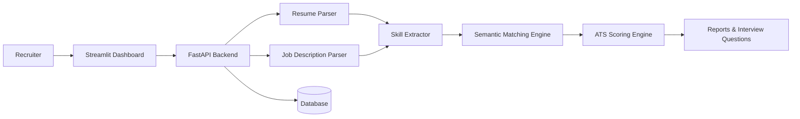

# HireSense AI

> AI-powered Resume Screening, ATS Scoring, Candidate Ranking & Recruiter Assistant.

HireSense AI is an end-to-end AI recruitment platform that automates resume screening using NLP, semantic similarity, ATS scoring, skill extraction, and recruiter-focused insights. Recruiters can upload multiple resumes, compare them against a job description, rank candidates instantly, identify skill gaps, and generate interview questions.

---

## 🚀 Live Demo

### 🌐 Frontend Dashboard
https://hiresense-ai-4r3pcjrfsdfrgkp7t5hnpw.streamlit.app/

### ⚙️ Backend API (Swagger Docs)
https://hiresense-ai-2-kyaw.onrender.com/docs

---

## ✨ Features

- 📄 Resume Parsing (PDF, DOCX, TXT)
- 🤖 AI-powered ATS Resume Scoring
- 🎯 Semantic Resume vs Job Description Matching
- 🧠 NLP-based Skill Extraction
- 📊 Candidate Ranking
- 📈 Recruiter Dashboard
- ❓ AI-generated Interview Questions
- 🔍 Skill Gap Analysis
- 📝 Recruiter-friendly Candidate Reports
- ⚡ FastAPI Backend
- 🎨 Streamlit Frontend
- 🗄 SQLAlchemy Database Support
- 🐳 Docker Support
- ☁️ Cloud Deployment Ready

---

# Architecture



---

# Tech Stack

| Category | Technologies |
|----------|--------------|
| Backend | FastAPI |
| Frontend | Streamlit |
| AI/NLP | Sentence Transformers, TF-IDF, spaCy |
| Database | SQLAlchemy, SQLite, PostgreSQL |
| File Processing | PyPDF2, python-docx |
| Deployment | Render, Streamlit Cloud |
| Containerization | Docker |

---

# Project Structure

```text
HireSense-AI/

├── app/
│   ├── api/
│   ├── database/
│   ├── ml/
│   ├── models/
│   ├── prompts/
│   ├── services/
│   └── utils/
│
├── frontend/
├── datasets/
├── notebooks/
├── screenshots/
├── tests/
│
├── Dockerfile
├── docker-compose.yml
├── requirements.txt
├── requirements-dev.txt
├── requirements-ml.txt
├── .env.example
└── README.md
```

---

# API Endpoints

| Method | Endpoint | Description |
|---------|----------|-------------|
| GET | `/health` | Health Check |
| GET | `/skills/catalog` | Skill Catalog |
| POST | `/analyze` | Analyze & Rank Candidates |

---

# API Request

### POST `/analyze`

Upload:

- One or more resumes
- Job Description
- Optional Job Title

Returns:

- ATS Score
- Candidate Ranking
- Skill Match %
- Missing Skills
- Recruiter Summary
- Interview Questions

---

# Deployment

## Frontend

Streamlit Community Cloud

https://hiresense-ai-4r3pcjrfsdfrgkp7t5hnpw.streamlit.app/

## Backend

Render

https://hiresense-ai-2-kyaw.onrender.com/docs

---

# Docker

```bash
docker compose up --build
```

---

# Testing

```bash
pytest
```

---

# Future Improvements

- Authentication & Recruiter Accounts
- Resume History
- Background Job Processing
- Analytics Dashboard
- LLM-powered Candidate Feedback
- Email Notifications
- Multi-company Support
- Vector Database Integration
- RAG-powered Resume Search

---

# License

This project is licensed under the MIT License.

---

## 👨‍💻 Author

Developed by **Ambur**

If you found this project helpful, consider giving it a ⭐ on GitHub.
